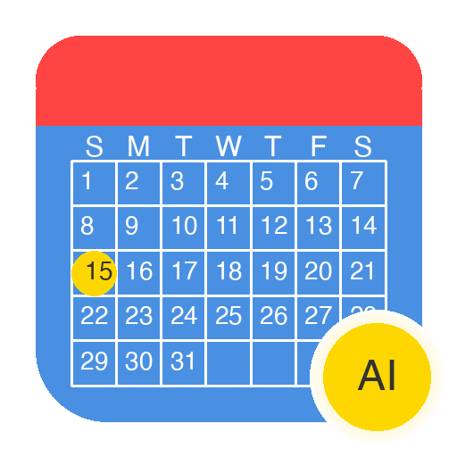

# Fantastical AI Calendar for Alfred

<p align="center">
  
</p>

Transform natural language into perfectly formatted Fantastical calendar events using OpenAI's advanced language processing.

## ✨ Why This Workflow?

Fantastical's natural language parser is powerful but can be finicky about syntax and word order. Small variations in phrasing can cause events to be misinterpreted or rejected. This workflow solves that by using OpenAI to intelligently normalize your input into a format Fantastical reliably understands.

### Before (Fantastical alone):
❌ "Lunch with Anna at Factory Girl tomorrow at noon" → May fail or misparse location/time

### After (with AI):
✅ "Lunch with Anna at Factory Girl tomorrow at noon" → "Lunch with Anna on Tuesday, August 12 at 12:00 PM at Factory Girl"

## 🎯 Features

- **🤖 AI-Powered Parsing**: OpenAI ensures reliable event creation
- **📅 Smart Date/Time Recognition**: Handles relative dates, recurring events, and complex schedules
- **📍 Location Extraction**: Automatically identifies and formats locations
- **🔄 Fallback System**: Works even when API is unavailable
- **🔐 Secure**: API keys stored locally, never transmitted except to OpenAI
- **⚡ Fast**: Sub-second event creation with caching
- **🎨 Natural Language**: Write events how you think, not how the parser wants

## 📦 Installation

1. **Download** the latest release from [Releases](https://github.com/ebowman/fantastical-alfred-ai/releases)
2. **Double-click** the `.alfredworkflow` file
3. **Configure** your OpenAI API key (see below)
4. **Start creating** events with `focal`

## 🔑 Configuration

### Getting an OpenAI API Key

1. Visit [OpenAI Platform](https://platform.openai.com/api-keys)
2. Sign in or create a free account
3. Generate a new API key
4. Copy the key (starts with `sk-`)

### Adding Your API Key

Run the interactive setup:
```bash
python3 setup_config.py
```

Or manually create `openai_key.txt`:
```bash
echo "sk-your-api-key" > openai_key.txt
```

## 🚀 Usage

Type `focal` in Alfred followed by your natural language event:

```
focal Lunch with Sarah tomorrow at noon
focal Team standup every Monday at 10am
focal Doctor appointment next Friday at 3:30pm at Medical Center
focal Conference call with Tokyo office Tuesday 9am PST
focal Birthday dinner Saturday 7pm at Italian restaurant downtown
```

## 🏗️ Architecture

```
User Input → Alfred → Python Script → OpenAI API → AppleScript → Fantastical
                            ↓
                     Fallback Parser
```

The workflow:
1. Captures natural language input via Alfred
2. Sends to OpenAI for intelligent parsing
3. Generates optimized AppleScript command
4. Creates event in Fantastical
5. Falls back to direct parsing if API unavailable

## 🛠️ Development

### Requirements
- Python 3.8+
- Alfred 4+ with Powerpack
- Fantastical 3+
- macOS 10.15+

### Project Structure
```
fantastical-alfred-ai/
├── workflow/
│   ├── info.plist          # Alfred configuration
│   ├── create_event.py     # Main event creator
│   ├── config.py           # API key management
│   ├── prompt_engine.py    # OpenAI optimization
│   ├── error_handler.py    # Error handling
│   └── venv/              # Bundled Python environment
├── dist/                   # Packaged workflows
└── package_workflow.py     # Build script
```

### Building from Source
```bash
# Clone repository
git clone https://github.com/ebowman/fantastical-alfred-ai.git
cd fantastical-alfred-ai

# Create virtual environment
python3 -m venv workflow/venv
source workflow/venv/bin/activate

# Install dependencies
pip install openai

# Package workflow
python3 package_workflow.py
```

## 📝 Examples

### Simple Events
- `focal Coffee at 3pm` → "Coffee today at 3:00 PM"
- `focal Lunch tomorrow` → "Lunch tomorrow at 12:00 PM"

### Complex Events
- `focal Meeting with design team about Q4 planning next Tuesday from 2-4pm in Conference Room A`
- `focal Recurring standup every weekday at 9:30am starting next Monday`

### With Locations
- `focal Dinner at Nobu Friday 8pm` → Includes location
- `focal Flight to NYC tomorrow at 6am from SFO` → Recognizes airports

## 🤝 Contributing

Contributions are welcome! Please:
1. Fork the repository
2. Create a feature branch
3. Commit your changes
4. Push to the branch
5. Open a Pull Request

## 📄 License

MIT License - see [LICENSE](LICENSE) file for details

## 🙏 Acknowledgments

- [Alfred App](https://www.alfredapp.com/) for the amazing automation platform
- [Fantastical](https://flexibits.com/fantastical) for the best calendar app
- [OpenAI](https://openai.com/) for the powerful language models

## 📊 Stats

- **Version**: 1.0.0
- **Size**: ~6MB (includes Python environment)
- **Performance**: <1s average event creation
- **Compatibility**: macOS 10.15+, Alfred 4+, Fantastical 3+

---

<p align="center">
  Made with ❤️ by <a href="https://github.com/ebowman">Eric Bowman</a>
</p>